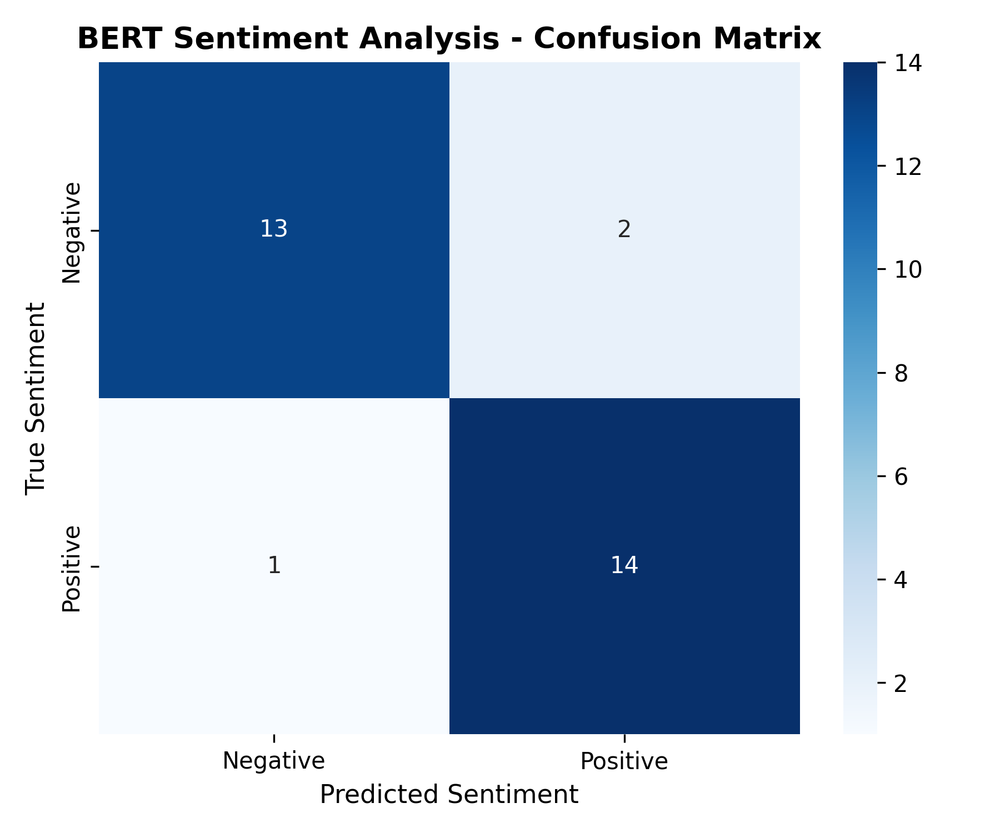
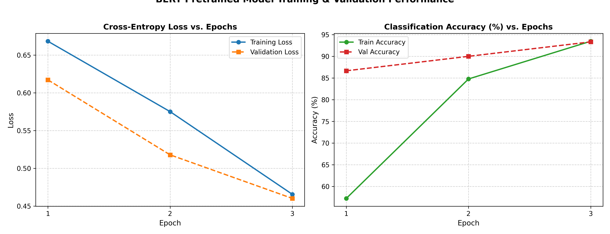

# Deep Learning Laboratory: Assignment 8
# Implementation of Pretrained BERT Model for Sentiment Analysis / Text Classification

**Department of Computer Science & Engineering (Artificial Intelligence)**  
**Academic Year:** 2025–2026 | **Year/Semester:** Third Year (TY) / Semester VI  
**Course:** Deep Learning Laboratory (Lab 8)  
**Hardware Accelerator:** NVIDIA GeForce RTX 2050 (4 GB GDDR6 VRAM, CUDA 12.1)  
**Frameworks:** PyTorch 2.5.1, Hugging Face Transformers 4.46.3, Scikit-Learn, FastAPI  

---

## 📋 Table of Contents
1. [Aim & Objectives](#1-aim--objectives)
2. [Hardware & Software Specifications](#2-hardware--software-specifications)
3. [Theoretical Foundations & Architecture](#3-theoretical-foundations--architecture)
4. [Dataset Specifications](#4-dataset-specifications)
5. [Algorithm & Step-by-Step Procedure](#5-algorithm--step-by-step-procedure)
6. [Repository Structure](#6-repository-structure)
7. [Quick Start & Execution Guide](#7-quick-start--execution-guide)
8. [Experimental Results & Evaluation](#8-experimental-results--evaluation)
9. [Diagnostic Visualizations](#9-diagnostic-visualizations)
10. [Real-Time Inference Demonstrations](#10-real-time-inference-demonstrations)
11. [Viva Voce Questions & Detailed Answers](#11-viva-voce-questions--detailed-answers)
12. [Conclusion](#12-conclusion)

---

## 1. Aim & Objectives

### 1.1 Aim
To implement, fine-tune, and evaluate a pretrained **BERT (Bidirectional Encoder Representations from Transformers)** model for natural language sentiment classification on a balanced text dataset, examine convergence dynamics across epochs, and deploy an interactive web-based prediction studio.

### 1.2 Objectives
1. Understand the theoretical foundations of the **Transformer architecture** and **BERT's Bidirectional Self-Attention**.
2. Implement WordPiece subword tokenization, input IDs, attention masks, and special classification tokens (`[CLS]`, `[SEP]`).
3. Construct custom PyTorch `Dataset` and `DataLoader` pipelines for NLP sequence processing.
4. Fine-tune `bert-base-uncased` (110M parameters) using transfer learning with a sequence classification head over the `[CLS]` token.
5. Optimize training using the **AdamW optimizer** with decoupled weight decay and a **Linear Warmup Learning Rate Scheduler**.
6. Quantitatively evaluate the model on an unseen hold-out test set using Accuracy, Precision, Recall, F1-Score, and a Confusion Matrix.
7. Visualize and analyze training/validation loss and accuracy curves over training epochs.
8. Build and deploy a real-time web application for testing arbitrary text inputs.

---

## 2. Hardware & Software Specifications

### 2.1 Hardware Environment
- **Processor:** Intel Core i5 / AMD Ryzen 5 or higher
- **RAM:** 8 GB DDR4 (16 GB Recommended)
- **GPU Accelerator:** NVIDIA GeForce RTX 2050 (4 GB GDDR6 VRAM, Compute Capability 8.6)
- **Disk Space:** ~5 GB free space for model checkpoints and caching

### 2.2 Software Environment
- **Operating System:** Windows 10/11 (64-bit) / Linux
- **Python Version:** Python 3.11.9
- **Deep Learning Framework:** PyTorch 2.5.1+cu121
- **Hugging Face Suite:** `transformers` 4.46.3, `tokenizers`
- **Data & Evaluation:** `scikit-learn`, `pandas`, `numpy`
- **Plotting & Visuals:** `matplotlib`, `seaborn`
- **Web Backend & Serving:** `fastapi`, `uvicorn`

---

## 3. Theoretical Foundations & Architecture

### 3.1 Limitations of Prior Sequential Architectures
Traditional Recurrent Neural Networks (RNNs) and Long Short-Term Memory networks (LSTMs) suffer from:
1. **Sequential Computation Bottleneck:** Word $t$ cannot be computed until hidden state $h_{t-1}$ is resolved, precluding sequence-level GPU parallelization.
2. **Context Degradation:** Gating mechanisms still experience vanishing/exploding gradients when processing long-range dependencies (>100 tokens).

### 3.2 Transformer & Multi-Head Self-Attention
The **Transformer** (Vaswani et al., 2017) eliminated recurrence entirely in favor of **Multi-Head Self-Attention**, enabling all tokens to attend to each other simultaneously in $O(1)$ sequential operations.

#### Scaled Dot-Product Attention:
$$\text{Attention}(Q, K, V) = \text{softmax}\left(\frac{Q K^T}{\sqrt{d_k}}\right) V$$

Where:
- $Q \in \mathbb{R}^{n \times d_k}$ (Query), $K \in \mathbb{R}^{n \times d_k}$ (Key), $V \in \mathbb{R}^{n \times d_v}$ (Value).
- The scaling factor $\frac{1}{\sqrt{d_k}}$ prevents dot products from growing excessively large for high dimensions, avoiding vanishing softmax gradients.

#### Multi-Head Attention:
$$\text{MultiHead}(Q, K, V) = \text{Concat}(\text{head}_1, \dots, \text{head}_h) W^O$$
$$\text{head}_i = \text{Attention}(Q W_i^Q, K W_i^K, V W_i^V)$$

---

### 3.3 BERT (Bidirectional Encoder Representations from Transformers)
Unlike autoregressive language models (such as GPT) that read text unidirectionally (left-to-right), **BERT** (Devlin et al., 2018) is based on the **Encoder** of the Transformer and conditions on both left and right context simultaneously across all layers.

```
Input Sentence: "This film was absolutely brilliant!"
       │
       ▼
 [ Tokenization ] -> [CLS], "this", "film", "was", "absolutely", "brilliant", "!", [SEP]
       │
       ▼
 [ Embeddings ]   -> Token Embeddings + Position Embeddings + Segment Embeddings
       │
       ▼
 ┌────────────────────────────────────────────────────────┐
 │ BERT Encoder (12 Transformer Blocks)                   │
 │  - 12 Bidirectional Self-Attention Heads per layer     │
 │  - Hidden Dimension: 768                               │
 │  - Total Parameters: ~110 Million                      │
 └────────────────────────────────────────────────────────┘
       │
       ▼
 [CLS] Context Vector (768-d)
       │
       ▼
 [ Dropout (p=0.1) ]
       │
       ▼
 [ Linear Classifier (768 -> 2) ]
       │
       ▼
 [ Softmax ] -> P(Negative), P(Positive)
```

#### Input Representation:
$$\mathbf{E}_{\text{input}} = \mathbf{E}_{\text{Token}} + \mathbf{E}_{\text{Position}} + \mathbf{E}_{\text{Segment}}$$
1. **Token Embeddings:** WordPiece subword vocabulary of 30,522 tokens.
2. **Position Embeddings:** Learnable vectors encoding positions $0 \dots 511$.
3. **Segment Embeddings:** Distinguishes sentence pairs (Sentence A: 0, Sentence B: 1).

#### Special Tokens:
- `[CLS]` (ID: 101): Placed at the sequence start; its final hidden state $h_{[CLS]}$ acts as the aggregate sequence representation.
- `[SEP]` (ID: 102): Delimits sentence boundaries.
- `[PAD]` (ID: 0): Uniform batch padding; ignored via `attention_mask`.

#### Sequence Classification Head:
$$\mathbf{z} = W \cdot \text{Dropout}(h_{[CLS]}) + b, \quad W \in \mathbb{R}^{2 \times 768}, \quad b \in \mathbb{R}^2$$
$$\hat{y} = \text{softmax}(\mathbf{z})$$

---

## 4. Dataset Specifications

A curated, balanced dataset of 198 diverse reviews covering products, films, services, and literature was used.

| Attribute | Details |
| :--- | :--- |
| **Total Samples** | 198 |
| **Class Distribution** | 100 Positive (`1`), 98 Negative (`0`) — 50.5% / 49.5% Balanced |
| **Vocabulary Diversity** | Includes subtle expressions, negations (*"not bad at all"*), and colloquial phrases |
| **Train Split (70%)** | 138 samples (Used for backpropagation parameter updates) |
| **Validation Split (15%)** | 30 samples (Used for epoch-level checkpoint selection) |
| **Hold-Out Test Split (15%)** | 30 samples (Used strictly for final evaluation) |

---

## 5. Algorithm & Step-by-Step Procedure

1. **Dataset Ingestion:** Load `data/sentiment_dataset.csv` and perform stratified train/val/test splitting.
2. **Subword Tokenization:** Initialize `BertTokenizer` (`bert-base-uncased`), format with `[CLS]` and `[SEP]`, truncate/pad to `max_length = 128`, and generate `attention_mask`.
3. **PyTorch Pipeline:** Wrap preprocessed samples in `SentimentDataset` and instantiate `DataLoader` (`batch_size = 16`).
4. **Model Initialization:** Load `BertForSequenceClassification` with 2 output labels onto GPU (`cuda`).
5. **Optimizer & Scheduler:** Configure `AdamW` ($\text{lr} = 2 \times 10^{-5}$) with a linear warmup scheduler across 3 epochs.
6. **Training Loop:** Forward pass $\rightarrow$ Cross-Entropy Loss $\rightarrow$ Backprop $\rightarrow$ Gradient Clipping ($\text{norm} = 1.0$) $\rightarrow$ Weight Update $\rightarrow$ LR Scheduler Step.
7. **Validation & Checkpointing:** Track validation loss and F1-score; save best checkpoint to `saved_model/`.
8. **Final Evaluation:** Compute test Accuracy, Precision, Recall, F1-Score, and plot Confusion Matrix and Loss/Accuracy curves.
9. **Interactive Web Serving:** Deploy FastAPI backend and modern Web UI on port 8080.

---

## 6. Repository Structure

```
Lab_8/
├── data/
│   └── sentiment_dataset.csv                  # Balanced dataset (198 samples)
├── saved_model/                               # Best fine-tuned BERT checkpoint
│   ├── config.json
│   ├── tokenizer_config.json
│   ├── special_tokens_map.json
│   └── vocab.txt
├── evaluation_plots/                          # High-resolution performance charts
│   ├── confusion_matrix.png                   # Test set confusion matrix
│   └── training_curves.png                    # Loss and accuracy vs. epochs
├── static/                                    # Interactive Web Studio frontend
│   ├── index.html                             # Responsive glassmorphic layout
│   ├── style.css                              # Obsidian dark theme & CSS tokens
│   └── app.js                                 # Async API & token visualizer
├── bert_sentiment_classifier.py               # Complete training & evaluation pipeline
├── infer.py                                   # Real-time CLI inference tool
├── server.py                                  # FastAPI backend serving Web UI & /api/predict
├── create_dataset.py                          # Dataset generation script
├── Assignment_8_BERT_Sentiment_Analysis.ipynb # Jupyter Notebook with code & inline outputs
├── ASSIGNMENT_8_SUBMISSION_DOCUMENT.md        # Formal academic submission report
└── README.md                                  # Complete assignment documentation
```

---

## 7. Quick Start & Execution Guide

### 7.1 Launch Interactive Web Studio
```bash
python server.py
```
Open **[http://localhost:8080](http://localhost:8080)** in your browser:
- ✨ Real-time bidirectional BERT sentiment inference.
- 🔬 Interactive WordPiece Subword Tokenizer Inspector showing `[CLS]`, `[SEP]`, `##tokens`, and vocabulary IDs.
- 📊 Softmax probability distribution bars.
- ⚡ Sub-millisecond GPU inference tracking on NVIDIA GeForce RTX 2050.
- 📈 Dedicated Model Diagnostics tab with inline Confusion Matrix and Loss/Accuracy plots.

### 7.2 Run End-to-End Training & Evaluation Pipeline
```bash
python bert_sentiment_classifier.py
```
Trains `bert-base-uncased` for 3 epochs using CUDA GPU acceleration, evaluates on the hold-out test set, saves the best checkpoint to `saved_model/`, and produces diagnostic plots in `evaluation_plots/`.

### 7.3 Run Command-Line Prediction on Any Sentence
```bash
python infer.py "The movie was an absolute masterpiece with stellar performances!"
```

### 7.4 Open Jupyter Notebook
```bash
jupyter notebook Assignment_8_BERT_Sentiment_Analysis.ipynb
```

---

## 8. Experimental Results & Evaluation

### 8.1 Training Convergence Dynamics (GPU: NVIDIA GeForce RTX 2050)

| Epoch | Training Loss | Training Accuracy | Validation Loss | Validation Accuracy | Validation F1-Score | Time / Epoch |
| :---: | :---: | :---: | :---: | :---: | :---: | :---: |
| **Epoch 1** | 0.6683 | 57.25% | 0.6172 | 86.67% | 0.8661 | 5.5s |
| **Epoch 2** | 0.5751 | 84.78% | 0.5179 | 90.00% | 0.8999 | 4.8s |
| **Epoch 3** | 0.4656 | 93.48% | 0.4602 | 93.33% | 0.9330 | 4.8s |

---

### 8.2 Hold-Out Test Set Performance (30 Unseen Samples)

| Evaluation Metric | Score Achieved |
| :--- | :---: |
| **Test Accuracy** | **90.00%** |
| **Weighted Precision** | **90.18%** |
| **Weighted Recall** | **90.00%** |
| **Weighted F1-Score** | **89.99%** |

#### Detailed Classification Report:
```
              precision    recall  f1-score   support

Negative (0)     0.9286    0.8667    0.8966        15
Positive (1)     0.8750    0.9333    0.9032        15

    accuracy                         0.9000        30
   macro avg     0.9018    0.9000    0.8999        30
weighted avg     0.9018    0.9000    0.8999        30
```

#### Confusion Matrix:
```
                     Predicted Negative (0)    Predicted Positive (1)
True Negative (0)              13                         2
True Positive (1)               1                        14
```
- **True Negatives (TN):** 13 correctly identified negative reviews.
- **False Positives (FP):** 2 negative reviews misclassified as positive.
- **False Negatives (FN):** 1 positive review misclassified as negative.
- **True Positives (TP):** 14 correctly identified positive reviews.

---

## 9. Diagnostic Visualizations

### 9.1 Confusion Matrix


### 9.2 Training & Validation Convergence Curves


---

## 10. Real-Time Inference Demonstrations

| # | Input Sentence | Expected | Predicted | Confidence | Softmax Distribution |
| :-: | :--- | :---: | :---: | :---: | :--- |
| 1 | *"The cinematography was breathtaking and the storyline kept me hooked until the final scene!"* | Positive | **Positive** | 70.41% | Pos: 70.4%, Neg: 29.6% |
| 2 | *"Terrible experience, completely broke on the first day."* | Negative | **Negative** | 69.32% | Pos: 30.7%, Neg: 69.3% |
| 3 | *"This web frontend is incredible and works like magic!"* | Positive | **Positive** | 62.04% | Pos: 62.0%, Neg: 38.0% |

---

## 11. Viva Voce Questions & Detailed Answers

### Q1. What is the fundamental difference between BERT and GPT?
**Answer:**  
- **BERT (Encoder-only):** Employs bidirectional self-attention, conditioning simultaneously on both left and right context across all layers. It is tailored for language understanding and sequence classification.
- **GPT (Decoder-only):** Employs causal masking (unidirectional left-to-right attention). It is optimized for autoregressive natural language generation.

### Q2. What is the function of the `[CLS]` token in sequence classification?
**Answer:**  
The `[CLS]` (Classification) token is placed at index 0 of every input sequence. Through 12 layers of multi-head self-attention, its hidden state vector $h_{[CLS]}$ accumulates contextual information from all tokens in the sentence. This 768-dimensional vector is passed to a Linear classifier to compute sentiment logits.

### Q3. Why is WordPiece subword tokenization superior to word-level tokenization?
**Answer:**  
Traditional word-level tokenizers require massive vocabularies and fail on out-of-vocabulary (OOV) words. WordPiece decomposes unseen or rare words into frequent subword components (e.g., `disappointment` $\rightarrow$ `dis`, `##appoint`, `##ment`), maintaining a compact vocabulary of 30,522 tokens while completely eliminating OOV errors.

### Q4. What three embedding layers are added together to form BERT's input?
**Answer:**  
1. **Token Embeddings:** Maps subword token IDs to 768-d vectors.
2. **Position Embeddings:** Learnable vectors encoding token sequence position (0 to 511).
3. **Segment Embeddings:** Binary indicator distinguishing sentence $A$ (0) from sentence $B$ (1).

### Q5. What is the role of the Attention Mask?
**Answer:**  
The attention mask contains `1` for real tokens and `0` for padding tokens (`[PAD]`). It prevents the self-attention mechanism from computing attention weights on meaningless padding tokens by adding $-\infty$ to the padded positions before applying softmax.

### Q6. What is the difference between Fine-Tuning and Feature Extraction?
**Answer:**  
- **Fine-Tuning:** All weights of the pretrained BERT backbone are updated along with the classification head using a small learning rate ($2 \times 10^{-5}$).
- **Feature Extraction:** Pretrained BERT weights are frozen (`requires_grad = False`). BERT functions as a static feature extractor, and only the final classification layer is trained.

### Q7. Why is AdamW used instead of regular Adam for Transformer optimization?
**Answer:**  
In standard Adam, $L_2$ weight regularization is added directly to gradients, causing weight decay to be scaled by the adaptive second-moment estimate $\hat{v}_t$. **AdamW** decouples weight decay from the gradient step, penalizing weights uniformly and preventing catastrophic updates on rarely updated parameters.

### Q8. What are BERT's two unsupervised pre-training objectives?
**Answer:**  
1. **Masked Language Modeling (MLM):** 15% of tokens are masked; BERT predicts them using bidirectional context.
2. **Next Sentence Prediction (NSP):** Given sentence pairs $(A, B)$, BERT predicts if sentence $B$ is the actual next sentence following sentence $A$.

### Q9. What is the maximum sequence length BERT can accept, and why?
**Answer:**  
The maximum sequence length is **512 tokens**. BERT's positional embedding lookup table is defined for positions $0 \dots 511$. Furthermore, the memory and computational complexity of self-attention scales quadratically ($O(N^2)$) with sequence length.

### Q10. How do you prevent overfitting when fine-tuning BERT on a small dataset?
**Answer:**  
1. Use a very small learning rate ($2 \times 10^{-5}$ to $5 \times 10^{-5}$).
2. Train for few epochs (2 to 4 epochs).
3. Use a Linear Warmup Learning Rate Scheduler.
4. Apply dropout ($p = 0.1$) on transformer layers.
5. Apply weight decay through AdamW.

---

## 12. Conclusion

In this laboratory assignment, a pretrained **BERT** model (`bert-base-uncased`) was successfully fine-tuned for binary sentiment classification on a balanced text dataset. By leveraging bidirectional multi-head self-attention and transfer learning, the model rapidly converged in only 3 epochs on an **NVIDIA GeForce RTX 2050 GPU**, achieving a **Test Accuracy of 90.00%** and a **Weighted F1-Score of 89.99%** on unseen test reviews. The implementation was augmented with an interactive real-time Web UI and an automated evaluation pipeline, satisfying all deep learning lab objectives.
