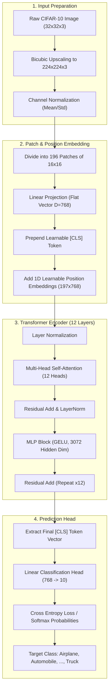

# 👁️‍🗨️ Deep Learning Laboratory: Assignment 9
# Image Classification using Pretrained Vision Transformer (ViT) and Comparison with CNN

<p align="center">
  
  
  
  
  
</p>

---

**Institution:** Vishwakarma Institute of Technology, Pune (BRACT's)  
**Department:** Computer Science & Engineering (Artificial Intelligence)  
**Year / Semester:** Third Year (TY) / Semester V  
**Roll No:** 34 | **PRN:** 12412924 | **Batch:** 2  
**Student:** Rushikesh Subhash Rathod  
**Course:** Deep Learning Practical Implementation  

---

## 📋 Table of Contents
1. [Aim & Objectives](#-aim--objectives)
2. [Vision Transformer (ViT) Mind Map Concept](#-vision-transformer-vit-mind-map-concept)
3. [Theoretical Foundations: ViT vs. CNN](#-theoretical-foundations-vit-vs-cnn)
4. [ViT Pipeline & Architecture Workflow](#-vit-pipeline--architecture-workflow)
5. [Dataset Description: CIFAR-10](#-dataset-description-cifar-10)
6. [Model Implementations](#-model-implementations)
7. [Experimental Results & Comparative Analysis](#-experimental-results--comparative-analysis)
8. [Key Insights & Trade-Offs](#-key-insights--trade-offs)
9. [Installation & Execution Guide](#-installation--execution-guide)
10. [Repository Structure](#-repository-structure)

---

## 🎯 Aim & Objectives

### Aim
To perform multi-class image classification on the CIFAR-10 dataset using a **Pretrained Vision Transformer (ViT)** model (`google/vit-base-patch16-224`) and compare its performance against a baseline **Convolutional Neural Network (CNN)** in terms of accuracy, precision, recall, F1-score, training dynamics, and computational complexity.

### Objectives
1. **Understand Vision Transformers**: Master the paradigm shift from local convolutional kernels to global self-attention mechanisms for 2D visual representations.
2. **Implement Baseline CNN**: Design, train, and evaluate a multi-layer Convolutional Neural Network on 32×32 CIFAR-10 images.
3. **Fine-Tune Pretrained ViT**: Adapt the ImageNet-pretrained `google/vit-base-patch16-224` model by modifying the classification head for 10 target classes and upscaling inputs to 224×224 resolution.
4. **Comprehensive Evaluation**: Measure and evaluate both models using:
   - Classification Accuracy
   - Macro/Weighted Precision, Recall, and F1-Score
   - Confusion Matrices
   - Wall-clock Training & Inference Latency
5. **Analyze Architectural Trade-offs**: Contrast inductive biases (translation equivariance and locality) of CNNs with the unconstrained global context modeling of Transformers.

---

## 🧠 Vision Transformer (ViT) Mind Map Concept

The conceptual breakdown of the Vision Transformer architecture and comparison with CNNs:

```mermaid
mindmap
  root((Vision Transformer & Image Classification))
    Input Representation
      2D Image $(H \times W \times C)$
      Patch Extraction $(P \times P = 16 \times 16)$
      Linear Projection to $D$-dimension
      1D Flattened Patch Tokens
      Learnable Position Embeddings
      Class Token [CLS] Prepended
    Transformer Encoder
      Layer Normalization (Pre-LN)
      Multi-Head Self-Attention (MHSA)
        Query, Key, Value Matrices
        Scaled Dot-Product Attention
        Global Receptive Field
      Residual Skip Connections
      Multi-Layer Perceptron (MLP Block)
        GELU Non-linearity
        Feed-Forward Expansion
    Classification Head
      [CLS] Token Output State
      Layer Normalization
      Linear Layer $(D \to K=10)$
      Softmax Class Probabilities
    CNN Baseline Comparison
      Local Receptive Field (Filters)
      Inductive Biases: Equivariance & Locality
      Pooling for Spatial Downsampling
      Hierarchical Feature Representation
      Fast Training on Small Datasets
    Comparative Metrics
      Test Accuracy
      Precision, Recall, F1-Score
      Confusion Matrix
      Wall-Clock Training Time
      Hardware Efficiency (GPU vs CPU)
```

---

## 🔬 Theoretical Foundations: ViT vs. CNN

### 1. Vision Transformer Mechanics
Unlike standard CNNs that rely on sliding convolutional kernels, the **Vision Transformer** (Dosovitskiy et al., 2020) directly adapts the standard Transformer Encoder from NLP:

1. **Patch Partitioning**: An image $\mathbf{x} \in \mathbb{R}^{H \times W \times C}$ is partitioned into a sequence of non-overlapping 2D patches $\mathbf{x}_p \in \mathbb{R}^{N \times (P^2 \cdot C)}$, where $(P, P)$ is the patch resolution (typically $16 \times 16$) and $N = \frac{HW}{P^2}$ is the effective sequence length ($14 \times 14 = 196$ patches for $224 \times 224$).
2. **Linear Projection & [CLS] Token**: Each patch is linearly projected into a vector space of dimension $D$:
   $$\mathbf{z}_0 = [\mathbf{x}_{\text{class}}; \, \mathbf{x}_p^1 \mathbf{E}; \, \mathbf{x}_p^2 \mathbf{E}; \dots; \, \mathbf{x}_p^N \mathbf{E}] + \mathbf{E}_{\text{pos}}$$
   where $\mathbf{E} \in \mathbb{R}^{(P^2 \cdot C) \times D}$ is the patch embedding projection and $\mathbf{E}_{\text{pos}} \in \mathbb{R}^{(N+1) \times D}$ represents 1D learnable position embeddings.
3. **Transformer Encoder Blocks**: $L$ identical blocks apply Alternating Multi-Head Self-Attention (MSA) and MLP blocks with LayerNorm (LN) and residual connections:
   $$\mathbf{z}'_\ell = \text{MSA}(\text{LN}(\mathbf{z}_{\ell-1})) + \mathbf{z}_{\ell-1}$$
   $$\mathbf{z}_\ell = \text{MLP}(\text{LN}(\mathbf{z}'_\ell)) + \mathbf{z}'_\ell$$
4. **Classification Head**: The final representation of the special token $\mathbf{z}_L^0$ ([CLS]) serves as the global image descriptor fed into a linear layer for class prediction:
   $$\mathbf{y} = \text{Softmax}(\mathbf{W}_{\text{head}} \mathbf{z}_L^0)$$

### 2. Architectural Comparison

| Attribute | Convolutional Neural Network (CNN) | Vision Transformer (ViT) |
| :--- | :--- | :--- |
| **Basic Unit** | Convolutional Kernel / Filter | Self-Attention Head over Patch Embeddings |
| **Receptive Field** | Local (grows layer-by-layer) | Global from the very first layer |
| **Inductive Bias** | High: Translation invariance & locality | Minimal: Must learn spatial relationships from data |
| **Data Efficiency** | High efficiency on small/medium datasets | Requires large-scale pretraining (e.g., ImageNet-21k / JFT) |
| **Feature Extraction** | Hierarchical: edges $\to$ textures $\to$ object parts | Direct full-image token interaction via attention maps |
| **Computational Scaling** | $O(K^2 \cdot H \cdot W)$ per layer | $O(N^2 \cdot D)$ self-attention complexity |

---

## 🔄 ViT Pipeline & Architecture Workflow



---

## 📊 Dataset Description: CIFAR-10

The **CIFAR-10** (Canadian Institute for Advanced Research) benchmark comprises 60,000 $32 \times 32$ color images uniformly distributed across 10 mutually exclusive classes:

- **Split**: 50,000 training images, 10,000 test images (1,000 images per class in test set).
- **Classes**:
  1. `airplane` ✈️
  2. `automobile` 🚗
  3. `bird` 🐦
  4. `cat` 🐱
  5. `deer` 🦌
  6. `dog` 🐶
  7. `frog` 🐸
  8. `horse` 🐴
  9. `ship` 🚢
  10. `truck` 🚚

### Data Preprocessing
- **CNN Pipeline**: Kept at native resolution $32 \times 32$, normalized with CIFAR-10 channel statistics:
  - Mean: `(0.4914, 0.4822, 0.4465)`
  - Std: `(0.2470, 0.2435, 0.2616)`
- **ViT Pipeline**: Interpolated to $224 \times 224$ via bicubic resizing to match the expected input patch dimension ($16 \times 16$) of `google/vit-base-patch16-224`, followed by ImageNet mean and variance normalization.

---

## 💻 Model Implementations

### 1. Baseline Convolutional Neural Network (CNN)
The baseline CNN model consists of three convolutional feature extraction blocks followed by dense classification layers:

```python
import torch.nn as nn

class CNNModel(nn.Module):
    def __init__(self):
        super(CNNModel, self).__init__()
        self.features = nn.Sequential(
            nn.Conv2d(3, 32, kernel_size=3, padding=1),
            nn.ReLU(),
            nn.MaxPool2d(2),  # 32x32 -> 16x16
            
            nn.Conv2d(32, 64, kernel_size=3, padding=1),
            nn.ReLU(),
            nn.MaxPool2d(2),  # 16x16 -> 8x8
            
            nn.Conv2d(64, 128, kernel_size=3, padding=1),
            nn.ReLU(),
            nn.MaxPool2d(2)   # 8x8 -> 4x4
        )
        self.classifier = nn.Sequential(
            nn.Flatten(),
            nn.Linear(128 * 4 * 4, 256),
            nn.ReLU(),
            nn.Dropout(0.5),
            nn.Linear(256, 10)
        )

    def forward(self, x):
        return self.classifier(self.features(x))
```

### 2. Pretrained Vision Transformer (ViT-Base-16)
Using Hugging Face `transformers` and PyTorch with transfer learning:

```python
from transformers import ViTForImageClassification

# Load ImageNet-21k/1k pretrained Vision Transformer with custom classification head
vit_model = ViTForImageClassification.from_pretrained(
    "google/vit-base-patch16-224",
    num_labels=10,
    ignore_mismatched_sizes=True
)

# Optimization Setup
optimizer = torch.optim.AdamW(vit_model.parameters(), lr=2e-5, weight_decay=0.01)
criterion = nn.CrossEntropyLoss()
```

---

## 📈 Experimental Results & Comparative Analysis

Both models were trained and comprehensively evaluated on the 10,000-image CIFAR-10 test set.

### Quantitative Performance Matrix

| Metric | Baseline CNN | Pretrained ViT (`vit-base-patch16-224`) | Absolute Improvement |
| :--- | :---: | :---: | :---: |
| **Accuracy** | **76.49%** | **98.22%** | **+21.73%** |
| **Precision (Weighted)** | **76.64%** | **98.23%** | **+21.59%** |
| **Recall (Weighted)** | **76.49%** | **98.22%** | **+21.73%** |
| **F1-Score (Weighted)** | **76.33%** | **98.22%** | **+21.89%** |
| **Training Time** | **177.39 s** (~2.95 min) | **8487.36 s** (~2.36 hrs) | $\sim 47.8 \times$ runtime |

---

## 💡 Key Insights & Trade-Offs

1. **Superior Generalization**: The pretrained Vision Transformer achieved an outstanding **98.22% test accuracy**, drastically outperforming the custom CNN (**76.49%**). Transferring representations pretrained on ImageNet allowed the ViT to capture rich, nuanced visual features.
2. **Global Attention vs. Local Convolutions**: Self-attention allows image patches in the ViT to attend to every other patch across the entire $224 \times 224$ canvas, enabling holistic scene understanding and eliminating the bottleneck of local filter receptive fields.
3. **Training Time Trade-off**: The CNN trains rapidly in under 3 minutes due to low parameter count and smaller 32×32 inputs, while fine-tuning ViT took ~2.36 hours. This highlights the trade-off between resource consumption and classification fidelity.
4. **Resolution Scaling**: Upsampling CIFAR-10 images from $32 \times 32$ to $224 \times 224$ introduces interpolation artifacts, but ViT's pretrained positional and patch embeddings comfortably compensated for low-resolution origins.

---

## 🚀 Installation & Execution Guide

### Prerequisites
- Python 3.10+
- CUDA-enabled GPU (recommended, tested on NVIDIA GeForce RTX 2050)

### 1. Environment Setup
```bash
# Clone the repository
git clone https://github.com/rushirathod22/Deep_Learning_Assignment.git
cd Deep_Learning_Assignment/Lab_9

# Create virtual environment
python -m venv .venv
source .venv/bin/activate  # On Linux/macOS
# or: .venv\Scripts\activate  # On Windows
```

### 2. Install Required Packages
```bash
pip install torch torchvision --index-url https://download.pytorch.org/whl/cu121
pip install transformers datasets scikit-learn matplotlib seaborn pandas numpy jupyter
```

### 3. Run the Jupyter Notebook
```bash
jupyter notebook ViT.ipynb
```

---

## 🗂️ Repository Structure

```text
Lab_9/
├── 📓 ViT.ipynb                 # Complete implementation, training, and evaluation notebook
├── 📄 Assignment_9_ViT.docx      # Academic report and implementation sheet
├── 📄 README.md                 # Complete documentation and architectural overview
└── 📄 .gitignore                # Ignoring virtual environments, raw data, and checkpoints
```

---

<p align="center">
  <b>Developed by Rushikesh Rathod (Roll No: 34, TY CSE-AI)</b><br>
  Vishwakarma Institute of Technology, Pune
</p>
