# 🧠 Deep Learning Laboratory Assignments

<p align="center">


</p>

<p align="center">

<strong>TY Artificial Intelligence Engineering</strong><br>
Deep Learning Practical Assignments and Implementations

</p>

---

## 📖 About

This repository contains my **Deep Learning laboratory assignments**, practical implementations, reports, datasets, and model visualizations.

The assignments are organized to demonstrate the progression from **data preprocessing and analysis** to **neural network modelling, training, evaluation, and image classification using Convolutional Neural Networks (CNNs).**

The main objective is to understand both the **theoretical concepts and practical implementation** of Deep Learning models using Python.

---

## 🎯 Objectives

Through these practical assignments, the following objectives are covered:

* Understand the fundamentals of Deep Learning.
* Understand how Artificial Neural Networks learn from data.
* Perform data preprocessing and exploratory analysis.
* Build and train neural network models.
* Understand forward propagation and backpropagation.
* Apply activation functions and optimization techniques.
* Evaluate trained models using suitable metrics.
* Visualize datasets and model performance.
* Understand Convolutional Neural Networks.
* Apply CNNs to image classification.
* Analyze predictions using confusion matrices and training curves.

---

# 🗂️ Repository Structure

```text
Deep_Learning_Assignment/
│
├── 📁 LAB_1/
│   ├── 📓 Assigment_1.ipynb
│   └── 📄 34_Rushikesh_Rathod.pdf
│
├── 📁 LAB_2/
│   ├── 📓 Lab_2.ipynb
│   ├── 📊 heart.csv
│   └── 📄 34_Rushikesh_Lab_2.docx
│
├── 📁 LAB_3/
│   ├── 📓 Model.ipynb
│   └── 📄 34_Rushikesh_Rathod_Lab_3.docx
│
├── 📁 LAB_4/
│   ├── 📓 Assignment_4_LSTM_TimeSeries.ipynb
│   └── 📄 Assignment_4_Document.docx
│
├── 📁 LAB_5/
│   ├── 📓 Assignment_5_Sequence_Classification.ipynb
│   └── 📄 Assignment_5_Document.docx
│
├── 📁 LAB_6/
│   ├── 📓 Lab4_CNN_Apple_Disease.ipynb
│   ├── 🐍 lab4_cnn_apple_disease.py
│   ├── 🖼️ sample_images.png
│   ├── 📈 training_history.png
│   ├── 📊 confusion_matrix.png
│   └── 🔍 predictions.png
│
├── 📁 LAB_7/
│   ├── 📓 Assignment_7_Transfer_Learning.ipynb
│   └── 📄 Assignment_7_Document.docx
│
├── 📁 Lab_8/
│   ├── 📓 Assignment_8_BERT_Sentiment_Analysis.ipynb
│   ├── 📄 Assignment_8_DL.docx
│   └── 📄 README.md
│
├── 📁 Lab_9/
│   ├── 📓 ViT.ipynb
│   ├── 📄 Assignment_9_ViT.docx
│   └── 📄 README.md
│
├── .gitignore
└── README.md
```

---

# 🧭 Learning Roadmap

The practicals follow a progressive Deep Learning workflow:

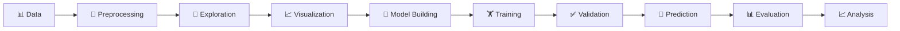

This progression demonstrates how a Deep Learning problem moves from **raw data to a trained and evaluated model**.

---

# 📚 Laboratory Work

## 🔹 LAB 1 | Deep Learning Fundamentals

### Focus

Introduction to the basic concepts and workflow used in Deep Learning.

### Concepts

* Introduction to Deep Learning
* Artificial Intelligence vs Machine Learning vs Deep Learning
* Neural Networks
* Data preparation
* Model workflow
* Basic data analysis
* Visualization

### Workflow

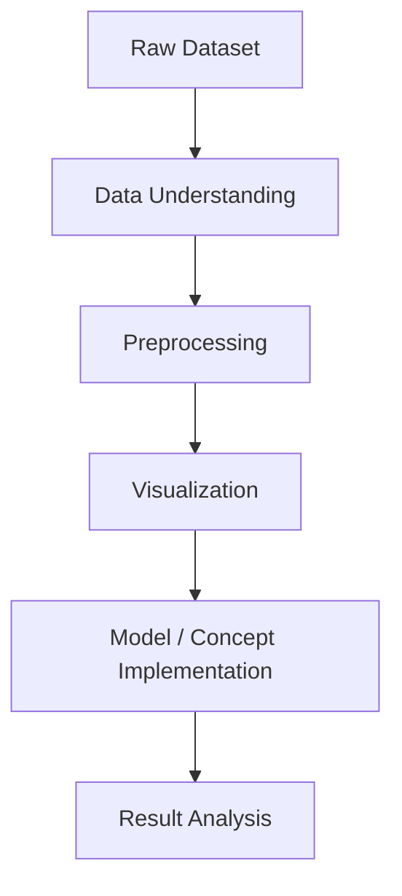

### Purpose

This laboratory establishes the foundation required for understanding more advanced Deep Learning models.

---

# ❤️ LAB 2 | Heart Disease Classification

### Dataset

The laboratory uses a **Heart Disease dataset (`heart.csv`)** for classification.

### Concepts Used

* Dataset loading
* Exploratory Data Analysis
* Feature analysis
* Data preprocessing
* Feature scaling
* Train-test split
* Neural Network classification
* Model training
* Prediction
* Model evaluation
* Visualization

### Deep Learning Pipeline

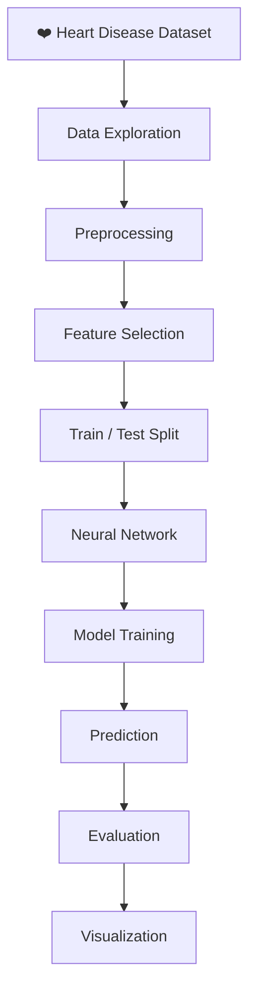

### Why Visualization?

Visualization helps understand:

* Feature distributions
* Class distribution
* Relationships between variables
* Model performance
* Prediction results

---

# 🧠 LAB 3 | Neural Network Model

### Focus

Implementation and understanding of a Deep Learning model using a neural network architecture.

### Concepts Used

* Neural Network architecture
* Input layer
* Hidden layers
* Output layer
* Weights
* Bias
* Activation functions
* Forward propagation
* Loss calculation
* Backpropagation
* Model training
* Prediction
* Evaluation

### Neural Network Architecture

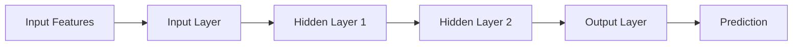

### Learning Process

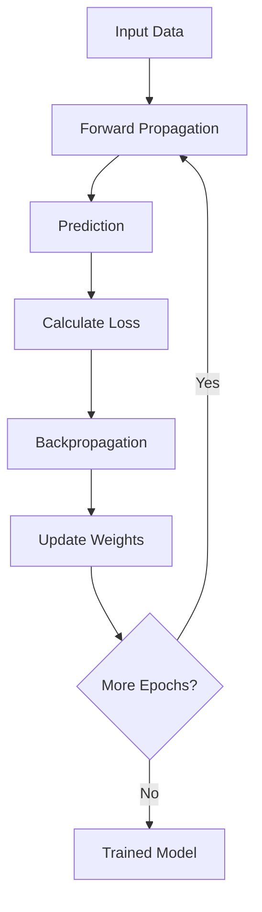

The process demonstrates how a neural network gradually updates its parameters to reduce prediction error.

---

# ⏱️ LAB 4 | LSTM Time Series Forecasting

### Focus

This laboratory implements a Long Short-Term Memory (LSTM) network for learning patterns in sequential and time-series data.

### Concepts Used

* Time-series data preparation
* Sequence generation
* Data normalization
* LSTM architecture
* Model training and validation
* Forecasting and prediction visualization

---

# 📝 LAB 5 | Sequence Classification

### Focus

This laboratory applies recurrent neural networks to classify sequential data based on patterns learned from input sequences.

### Concepts Used

* Sequence preprocessing
* Token or feature representation
* Recurrent neural network layers
* Sequence classification
* Training and validation
* Accuracy and loss evaluation

---

# 🍎 LAB 6 | CNN Based Apple Disease Classification

### Focus

This laboratory applies a **Convolutional Neural Network (CNN)** to image classification for detecting/classifying apple leaf diseases.

### Files

| File                           | Purpose                          |
| ------------------------------ | -------------------------------- |
| `Lab4_CNN_Apple_Disease.ipynb` | Complete notebook implementation |
| `lab4_cnn_apple_disease.py`    | Python implementation            |
| `sample_images.png`            | Sample image visualization       |
| `training_history.png`         | Training performance             |
| `confusion_matrix.png`         | Classification evaluation        |
| `predictions.png`              | Model predictions                |

The current LAB 6 folder contains these CNN implementation and visualization artifacts.

---

## 🔬 CNN Concepts Used

### 1. Convolution

Extracts important visual features from images.

Examples:

* Edges
* Textures
* Shapes
* Patterns

### 2. Activation Function

Introduces non-linearity into the network.

A commonly used activation is **ReLU**:

```text
ReLU(x) = max(0, x)
```

### 3. Pooling

Reduces the spatial size of feature maps while retaining important information.

### 4. Flattening

Converts extracted feature maps into a one-dimensional representation.

### 5. Dense Layers

Use extracted features for final classification.

### 6. Output Layer

Produces the final predicted class.

---

# 🧠 CNN Architecture

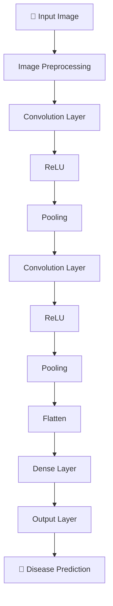

---

# 📈 Model Training Visualization

Training history is used to understand how the model learns over multiple epochs.

### Metrics

* Training Accuracy
* Validation Accuracy
* Training Loss
* Validation Loss

### Training Concept

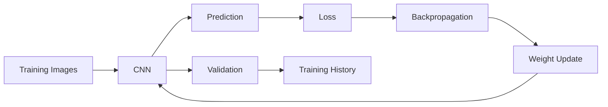

### Training History

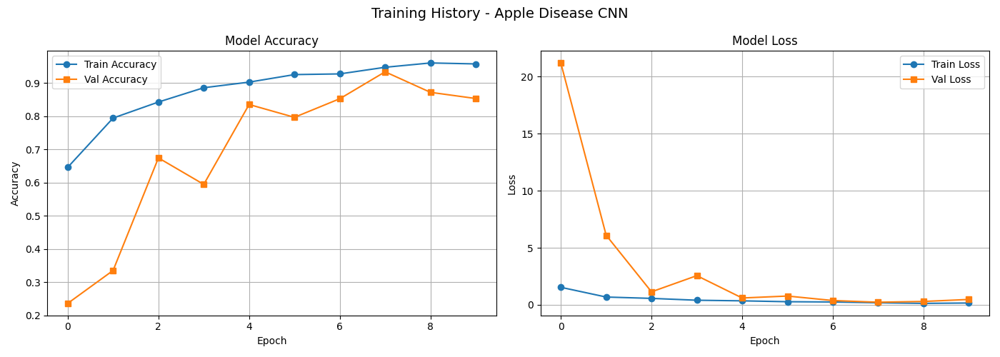

---

# 📊 Confusion Matrix

A confusion matrix is used to evaluate the classification performance of the CNN.

It helps identify:

* Correct predictions
* Incorrect predictions
* Class-wise performance
* Misclassification between classes

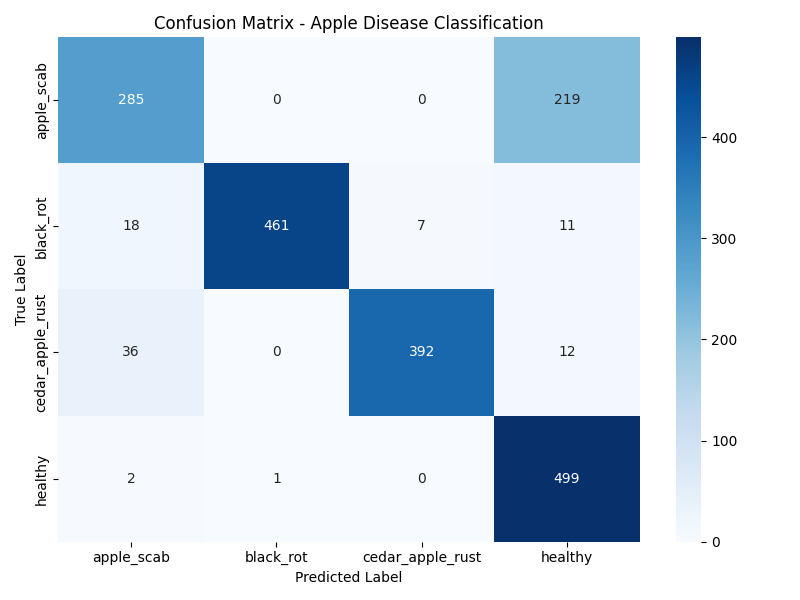

---

# 🔍 Prediction Visualization

The prediction output provides a visual comparison between the input image and the model's predicted class.

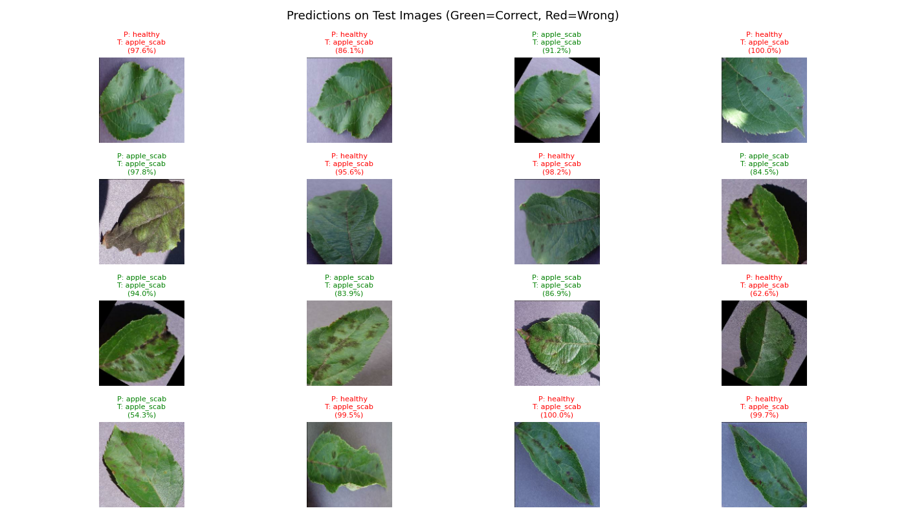

---

# 🖼️ Sample Images

Sample images are included to understand the image data used by the CNN.

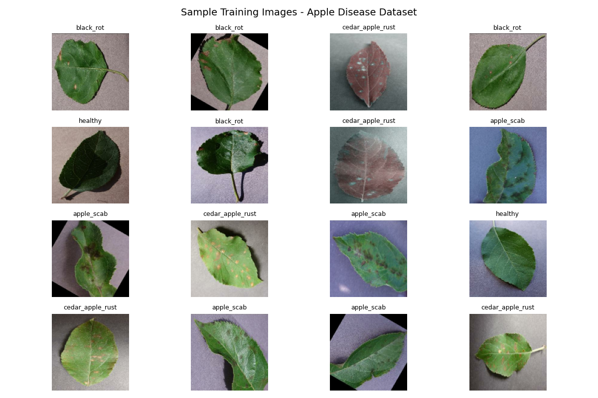

---

# 🔁 LAB 7 | Transfer Learning

### Focus

This laboratory uses pre-trained convolutional models for image classification on a CIFAR-10 subset.

### Models Compared

* VGG16
* ResNet50
* EfficientNetB0

### Concepts Used

* Pre-trained ImageNet models
* Feature extraction with frozen base layers
* Transfer learning
* Image preprocessing
* Model evaluation
* Accuracy comparison and visualization

---

# 📝 LAB 8 | Transformer Models for NLP (BERT)

### Focus

Implementation and fine-tuning of a pretrained **BERT (Bidirectional Encoder Representations from Transformers)** model for sequence sentiment classification on text data.

### Concepts Used

* Transformer Encoder architecture & Bidirectional Self-Attention
* WordPiece subword tokenization, attention masks, and `[CLS]`, `[SEP]` tokens
* Fine-tuning `bert-base-uncased` with sequence classification heads
* AdamW optimizer with decoupled weight decay & linear warmup learning rate schedules
* Test evaluation using Accuracy, Precision, Recall, F1-Score, and Confusion Matrix

---

# 👁️‍🗨️ LAB 9 | Vision Transformers (ViT) vs. CNNs

### Focus

Comprehensive image classification benchmarking on the **CIFAR-10** dataset comparing a custom **Convolutional Neural Network (CNN)** against a fine-tuned Pretrained **Vision Transformer (ViT)** (`google/vit-base-patch16-224`).

### Models Compared

* **Baseline CNN**: 3-stage convolutional network with $3\times3$ kernels, ReLU activations, Max-Pooling downsampling, Dropout regularization, and dense classification layers.
* **Pretrained ViT**: ImageNet-pretrained `google/vit-base-patch16-224` (12 encoder layers, 12 attention heads, hidden dimension 768) fine-tuned with a 10-class linear classification head.

### Concepts Used

* Image patch extraction ($16 \times 16$) & linear projection to latent dimension $D=768$
* Learnable 1D position embeddings & prepended `[CLS]` classification token
* Multi-Head Self-Attention (MHSA) enabling an immediate global receptive field
* Resolution adaptation via bicubic resizing ($32 \times 32 \to 224 \times 224$)
* Inductive bias comparison (local convolutional equivariance vs. global attention context)
* Comprehensive evaluation: Accuracy, Precision, Recall, F1-Score, and Training Latency

### Quantitative Results on CIFAR-10

| Metric | Baseline CNN | Pretrained ViT (`vit-base-patch16-224`) | Performance Delta |
| :--- | :---: | :---: | :---: |
| **Accuracy** | 76.49% | **98.22%** | **+21.73%** |
| **Precision** | 76.64% | **98.23%** | **+21.59%** |
| **Recall** | 76.49% | **98.22%** | **+21.73%** |
| **F1 Score** | 76.33% | **98.22%** | **+21.89%** |
| **Training Time** | 177.39 s (~2.95 min) | 8487.36 s (~2.36 hrs) | $\sim 47.8 \times$ compute |

---


# 📊 Role of Visualization

Visualization is an important part of these assignments because numerical metrics alone do not always provide enough understanding.

| Visualization     | What It Helps Understand |
| ----------------- | ------------------------ |
| Dataset plots     | Data distribution        |
| Feature plots     | Feature relationships    |
| Accuracy graph    | Model learning           |
| Loss graph        | Training error           |
| Confusion Matrix  | Class-wise performance   |
| Sample Images     | Dataset characteristics  |
| Prediction Images | Model predictions        |

---

# 🔄 Complete Deep Learning Pipeline

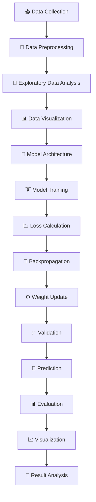

---

# 🛠️ Technologies & Tools

| Technology              | Usage                               |
| ----------------------- | ----------------------------------- |
| 🐍 **Python**           | Programming and implementation      |
| 📓 **Jupyter Notebook** | Interactive development             |
| 🔢 **NumPy**            | Numerical operations                |
| 🐼 **Pandas**           | Data manipulation                   |
| 📊 **Matplotlib**       | Visualization                       |
| 🤖 **Scikit-learn**     | Preprocessing and evaluation        |
| 🧠 **TensorFlow**       | Deep Learning                       |
| 🔥 **PyTorch**          | Deep Learning & Vision Transformers |
| 🤗 **Transformers**     | Pretrained ViT & BERT models        |
| 🔥 **Keras**            | Neural Network / CNN implementation |

---

# 🧩 Core Concepts Covered

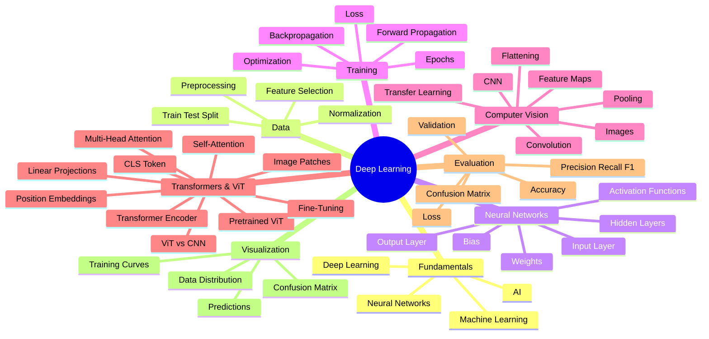

---

# 🎓 Learning Outcomes

After completing these practical assignments, I developed an understanding of:

* Fundamentals of Deep Learning.
* Neural network architecture and working.
* Data preprocessing for Machine Learning and Deep Learning.
* Training and validation of neural networks.
* Forward propagation and backpropagation.
* Activation functions and loss functions.
* Model prediction and evaluation.
* Visualization of training performance.
* CNN architecture and image classification.
* LSTM-based time-series forecasting.
* Sequence classification using recurrent models.
* Transfer learning with pre-trained image models.
* Transformer architectures and Bidirectional Self-Attention using pretrained BERT.
* Vision Transformer (ViT) architecture, patch embedding, and self-attention in computer vision.
* Fine-tuning pretrained Vision Transformers (`google/vit-base-patch16-224`) vs. training CNNs from scratch.
* Analysis of model predictions using confusion matrices and evaluation metrics.

---

# 🚀 Installation & Setup

## 1. Clone Repository

```bash
git clone https://github.com/rushirathod22/Deep_Learning_Assignment.git
```

## 2. Navigate to Repository

```bash
cd Deep_Learning_Assignment
```

## 3. Install Dependencies

```bash
pip install numpy pandas matplotlib scikit-learn tensorflow torch torchvision transformers jupyter
```

## 4. Launch Jupyter Notebook

```bash
jupyter notebook
```

Open the required laboratory folder and execute the notebook cells sequentially.

---

# 📋 Practical Summary

| Laboratory | Area            | Main Learning                        |
| ---------- | --------------- | ------------------------------------ |
| **LAB 1**  | Fundamentals    | Understanding Deep Learning workflow |
| **LAB 2**  | Classification  | Neural Network based classification  |
| **LAB 3**  | Neural Networks | Model architecture and training      |
| **LAB 4**  | Time Series     | LSTM-based sequence forecasting     |
| **LAB 5**  | Sequences       | Recurrent sequence classification   |
| **LAB 6**  | Computer Vision | CNN based image classification       |
| **LAB 7**  | Transfer Learning | Pre-trained model comparison       |
| **LAB 8**  | NLP & Transformers | Pretrained BERT Sentiment Analysis  |
| **LAB 9**  | Vision Transformers | Pretrained ViT vs CNN on CIFAR-10    |

---

# 📌 Academic Purpose

This repository is maintained as part of the **Deep Learning laboratory coursework** for academic learning and practical implementation.

The repository combines:

**Theory → Implementation → Training → Evaluation → Visualization → Analysis**

---

# 👨‍💻 Student

### Rushi Rathod

**TY Artificial Intelligence Engineering**

GitHub:
https://github.com/rushirathod22

---

<p align="center">

### 🧠 Learn • Implement • Visualize • Analyze

⭐ Thank you for visiting this repository!

</p>
