# 🧠 Deep Learning Assignments

<p align="center">

### Practical Implementation of Deep Learning Concepts

This repository contains the practical assignments completed as part of the **Deep Learning** course.
The work covers fundamental concepts, data preprocessing, neural networks, model training, evaluation, visualization, and **Convolutional Neural Networks (CNNs)**.

</p>

---

## 📌 About This Repository

The purpose of this repository is to document the practical implementation and understanding of important **Deep Learning concepts** through Python and Jupyter Notebook.

Each laboratory assignment focuses on a different stage of the Deep Learning workflow, starting from understanding and preparing data and progressing toward building, training, evaluating, and visualizing neural network models.

### 🔗 Repository

**GitHub:**
https://github.com/rushirathod22/Deep_Learning_Assignment

---

# 📚 Assignments Overview

| Lab       | Main Topic                      | Dataset / Application                    | Important Concepts                                             | Visualization                                  |
| --------- | ------------------------------- | ---------------------------------------- | -------------------------------------------------------------- | ---------------------------------------------- |
| **LAB 1** | Deep Learning Fundamentals      | Practical dataset / basic implementation | Data handling, preprocessing, fundamental DL concepts          | Data/model visualizations                      |
| **LAB 2** | Neural Network Classification   | Heart Disease Dataset                    | Data preprocessing, classification, ANN, training & evaluation | Performance visualization                      |
| **LAB 3** | Deep Learning Model             | Model-based implementation               | Neural network architecture, training, prediction              | Model/output analysis                          |
| **LAB 6** | CNN for Apple Disease Detection | Apple Disease Images                     | CNN, convolution, pooling, image classification                | Training curves, predictions, confusion matrix |

> The repository is continuously updated as new Deep Learning laboratory assignments are completed.

---

# 🧩 Deep Learning Workflow

The assignments follow the general Deep Learning pipeline:

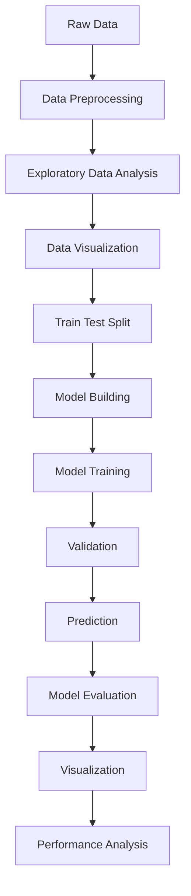

---

# 🔬 Concepts Covered

## 1. Data Preprocessing

Before training a Deep Learning model, the dataset needs to be prepared.

Important preprocessing operations include:

* Loading datasets
* Handling missing values
* Selecting features
* Encoding categorical data
* Feature scaling
* Normalization
* Train-test splitting
* Preparing input and target variables

### Why is preprocessing important?

Good preprocessing helps the model learn meaningful patterns and improves training stability and performance.

---

# 📊 Data Visualization

Visualization is used throughout the assignments to understand the dataset and analyze model performance.

Common visualizations include:

* Distribution plots
* Feature relationships
* Class distribution
* Training loss
* Validation loss
* Training accuracy
* Validation accuracy
* Prediction results
* Confusion matrix
* Sample images

### Typical Deep Learning visualization workflow

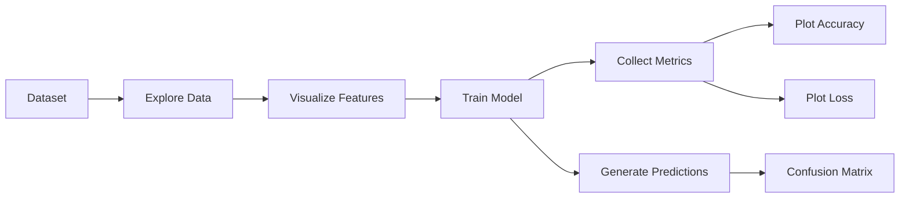

---

# ❤️ LAB 2: Heart Disease Classification

## Dataset

LAB 2 uses the **Heart Disease dataset (`heart.csv`)** for classification.

The notebook is accompanied by the dataset and practical documentation in the LAB_2 folder.

## Concepts Used

* Data loading
* Data preprocessing
* Exploratory Data Analysis
* Feature selection
* Classification
* Artificial Neural Network
* Model training
* Prediction
* Model evaluation
* Accuracy analysis

## Workflow

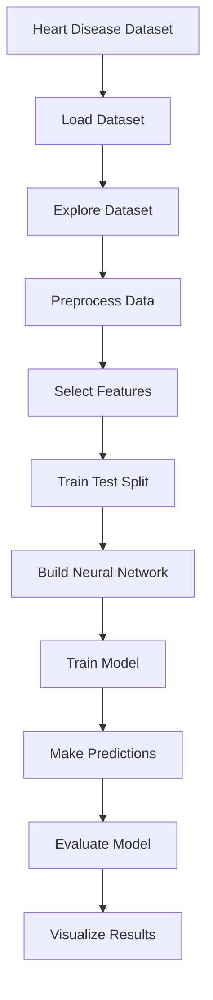

### Objective

The objective is to use patient-related features to train a neural network model capable of performing **heart disease classification**.

---

# 🧠 LAB 3: Deep Learning Model

LAB 3 focuses on implementing and experimenting with a Deep Learning model using a Jupyter Notebook.

## Concepts Used

* Neural network architecture
* Input and output layers
* Hidden layers
* Activation functions
* Model training
* Prediction
* Model evaluation
* Deep Learning workflow

## Neural Network Structure

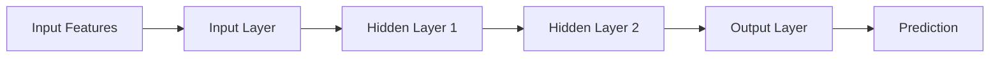

### Basic Learning Process

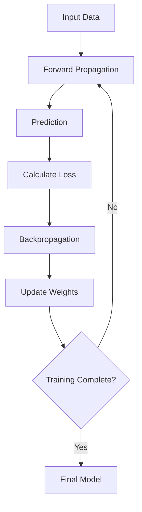

---

# 🍎 LAB 6: CNN Apple Disease Classification

LAB 6 contains a practical implementation of a **Convolutional Neural Network (CNN)** for Apple Disease classification.

The repository contains:

* `Lab4_CNN_Apple_Disease.ipynb`
* `lab4_cnn_apple_disease.py`
* `sample_images.png`
* `training_history.png`
* `confusion_matrix.png`
* `predictions.png`

This makes LAB 6 the main **Computer Vision / CNN** assignment in the repository.

---

## 🎯 Objective

The objective is to build a CNN model that can automatically learn visual features from apple leaf images and classify them according to disease categories.

---

# 🧠 CNN Architecture

The CNN follows the general image-classification pipeline:

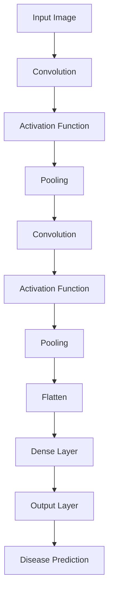

---

# 🔍 CNN Concepts Used

### 1. Convolution

Convolution layers extract important visual features from images such as:

* Edges
* Textures
* Shapes
* Patterns
* Disease-related visual characteristics

### 2. Activation Function

Activation functions introduce non-linearity into the neural network.

A common activation function used in CNNs is:

**ReLU**

```text
ReLU(x) = max(0, x)
```

### 3. Pooling

Pooling reduces the spatial dimensions of feature maps while retaining important information.

Common example:

**Max Pooling**

### 4. Flattening

The extracted feature maps are converted into a one-dimensional vector before being passed to dense layers.

### 5. Dense Layer

Dense layers use the extracted features to perform classification.

### 6. Output Layer

The final layer produces the predicted disease class.

---

# 📈 Model Training Visualization

Training history is used to understand how the model performs during training.

The repository contains:

**`training_history.png`**

Typical metrics include:

* Training accuracy
* Validation accuracy
* Training loss
* Validation loss

### Training process

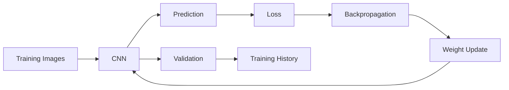

---

# 📊 Confusion Matrix

The repository also contains:

**`confusion_matrix.png`**

A confusion matrix helps analyze classification performance by showing:

* True Positive
* True Negative
* False Positive
* False Negative

For multi-class classification, it shows how samples from each class are predicted across all classes.

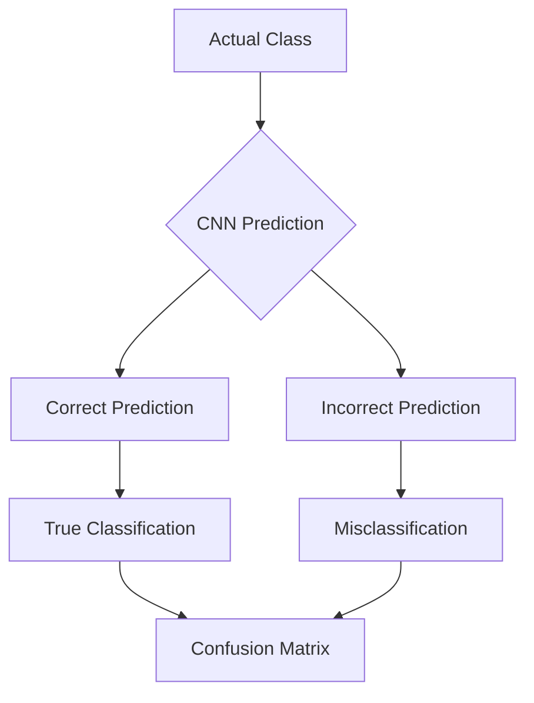

---

# 🖼️ Image Prediction

The repository includes:

**`predictions.png`**

This visualization can be used to inspect model predictions on sample images.

The general process is:

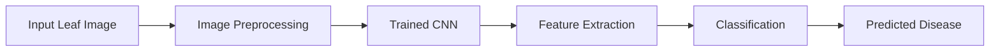

---

# 🖼️ Sample Images

The repository contains:

**`sample_images.png`**

Sample images provide a visual understanding of the image dataset and the classes used for training/testing.

---

# 🛠️ Technologies Used

| Technology             | Purpose                              |
| ---------------------- | ------------------------------------ |
| **Python**             | Programming language                 |
| **Jupyter Notebook**   | Interactive experimentation          |
| **NumPy**              | Numerical computation                |
| **Pandas**             | Data manipulation                    |
| **Matplotlib**         | Data and result visualization        |
| **Scikit-learn**       | Data preprocessing and evaluation    |
| **TensorFlow / Keras** | Deep Learning and CNN implementation |

---

# 📁 Repository Structure

```text
Deep_Learning_Assignment/
│
├── LAB_1/
│   ├── Assigment_1.ipynb
│   └── 34_Rushikesh_Rathod.pdf
│
├── LAB_2/
│   ├── Lab_2.ipynb
│   ├── heart.csv
│   └── 34_Rushikesh_Lab_2.docx
│
├── Lab_3/
│   ├── Model.ipynb
│   └── 34_Rushikesh_Rathod_Lab_3.docx
│
├── LAB_6/
│   ├── Lab4_CNN_Apple_Disease.ipynb
│   ├── lab4_cnn_apple_disease.py
│   ├── sample_images.png
│   ├── training_history.png
│   ├── confusion_matrix.png
│   ├── predictions.png
│   └── 34_Rushikesh_lab_6.docx
│
├── .gitignore
└── README.md
```

The current repository structure includes these lab folders and the listed notebooks, datasets, documentation, and CNN visualization outputs.

---

# 🔄 Complete Learning Pipeline

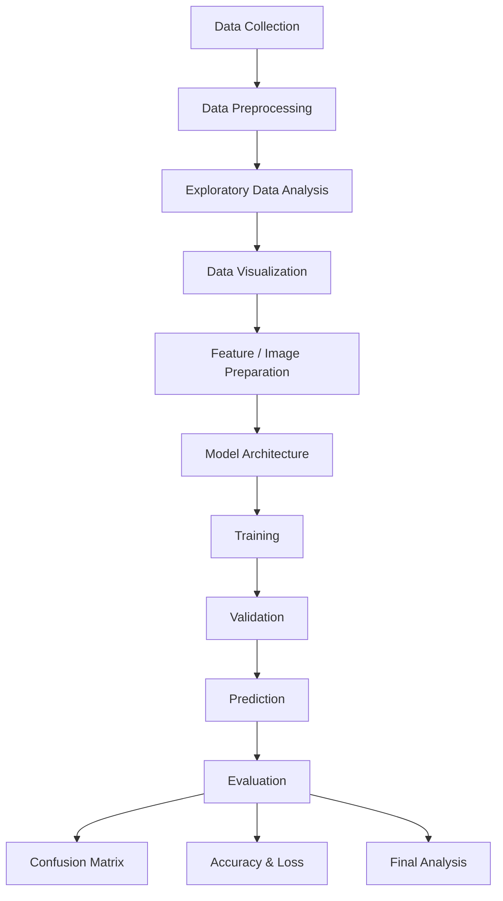

---

# 📚 Key Concepts Learned

Through these assignments, the following Deep Learning concepts are explored:

### Fundamentals

* Deep Learning
* Neural Networks
* Artificial Neurons
* Weights and Biases
* Activation Functions

### Data Preparation

* Data preprocessing
* Feature selection
* Normalization
* Train-test split

### Model Training

* Forward propagation
* Loss calculation
* Backpropagation
* Weight optimization
* Epochs
* Batch training

### Neural Networks

* Input layer
* Hidden layers
* Output layer
* Dense layers
* Activation functions

### Computer Vision

* Image preprocessing
* Convolution
* Feature maps
* Pooling
* Flattening
* CNN architecture
* Image classification

### Model Evaluation

* Accuracy
* Loss
* Predictions
* Confusion matrix
* Training/validation performance

### Visualization

* Dataset visualization
* Training accuracy
* Validation accuracy
* Training loss
* Validation loss
* Prediction visualization
* Confusion matrix

---

# 🎓 Learning Outcomes

After completing these assignments, I gained practical understanding of:

* How Deep Learning models process data.
* How neural networks learn from training data.
* How preprocessing affects model performance.
* How to build and train neural network models.
* How CNNs extract features from images.
* How image classification works.
* How to evaluate a trained model.
* How to visualize training performance.
* How to analyze classification errors using a confusion matrix.

---

# 💻 Installation

Clone the repository:

```bash
git clone https://github.com/rushirathod22/Deep_Learning_Assignment.git
```

Move into the project:

```bash
cd Deep_Learning_Assignment
```

Install the required Python libraries:

```bash
pip install numpy pandas matplotlib scikit-learn tensorflow jupyter
```

Start Jupyter Notebook:

```bash
jupyter notebook
```

Then open the required `.ipynb` file.

---

# 🚀 How to Use

1. Clone the repository.
2. Install the required dependencies.
3. Open the required laboratory folder.
4. Launch the Jupyter Notebook.
5. Run the cells sequentially.
6. Observe the generated visualizations.
7. Analyze model performance.
8. Compare predictions with actual results.

---

# 📌 Assignment Summary

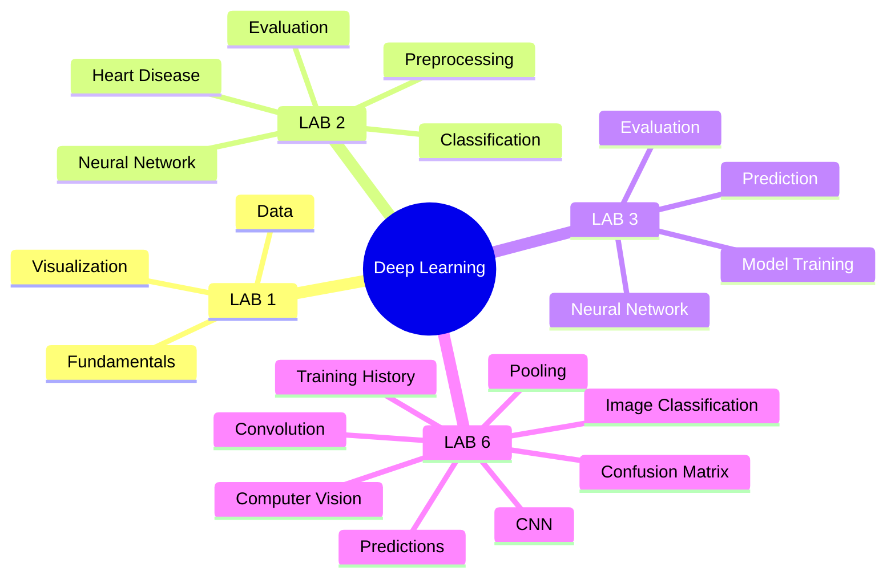

---

# 👨‍💻 Author

**Rushi Rathod**

AI Engineering Student

GitHub:
https://github.com/rushirathod22

---

# ⭐ Repository

If you find this repository useful for learning Deep Learning concepts, consider giving it a ⭐.

---

## 📜 Academic Note

This repository is maintained for **academic, practical learning, and educational purposes**. The assignments demonstrate the implementation and experimentation of Deep Learning concepts using Python and related libraries.
